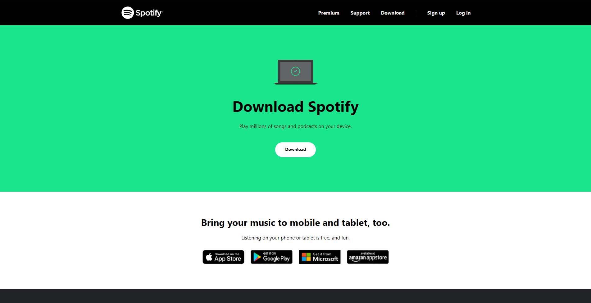
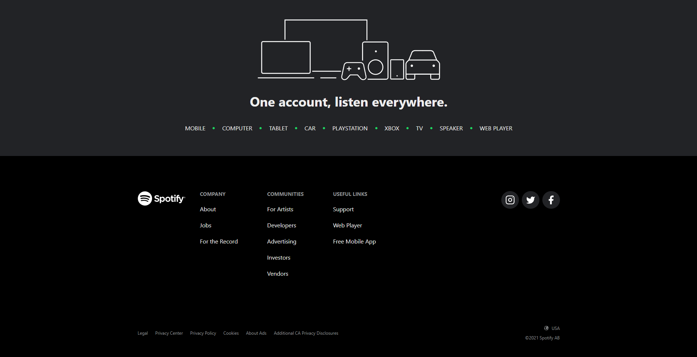

# Spotify Download Page Clone

## Screenshots

### Description
A responsive UI Clone of the [Spotify's download page](https://www.spotify.com/us/download/windows/) made with Chakra UI.

### Why I made this
Chakra UI is a still recent component library for developing pages, so I gave it a try.

### Tech:
* Next.js
* Typescript
* Chakra UI
